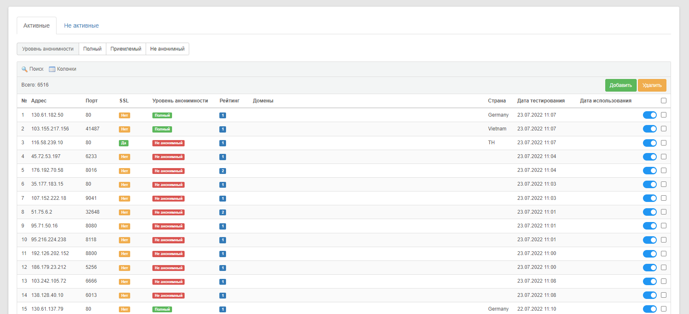

# Proxy

Модуль отправки запросов с использованием Proxy.\
Создан на базе фреймворка [Core2](https://github.com/easterism/core2)

### Функции

- Сбор публичных прокси адресов
- Тестирование полученных адресов на активность и анонимность
- Создание параллельных запросов с использованием базы прокси

